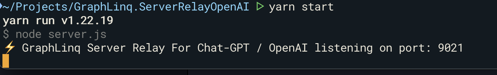

# GraphLinq Server Relay For Chat-GPT / OpenAI

This server accepts a `POST` request to `/chat`, and uses the server's API Key and IP address to pass the query to the openai API. By running multiple instances spread out to geographically separate servers, would allow for load balancing.

## Install

`git clone git@github.com:GraphLinq/GraphLinq.ServerRelayOpenAI.git`

`yarn install`

## Settings

Edit `server.js` and set your API Key.

## Running

`yarn start`

